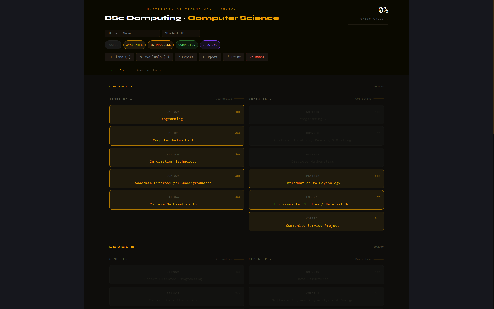
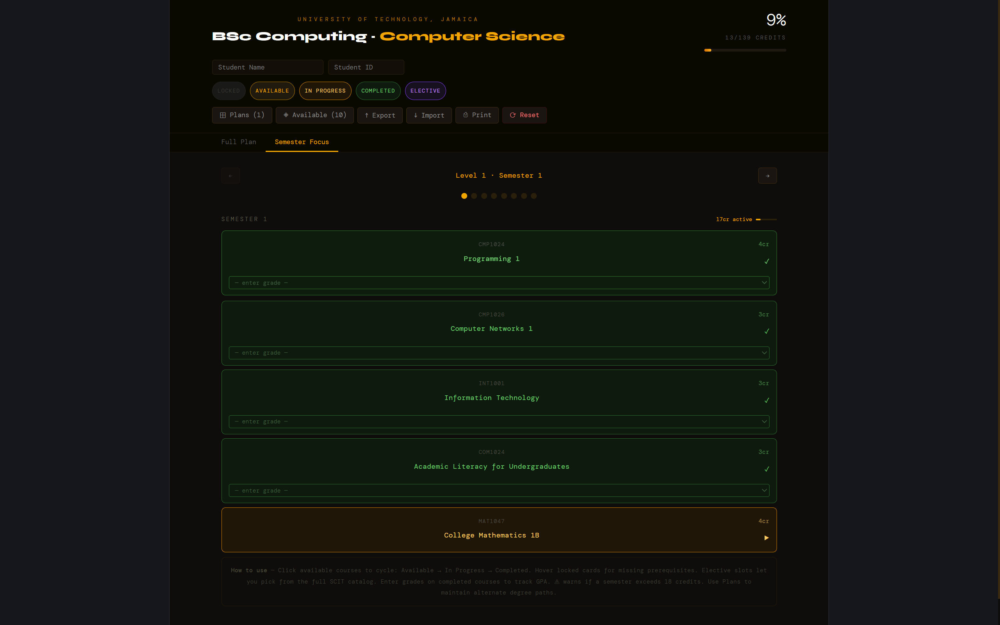
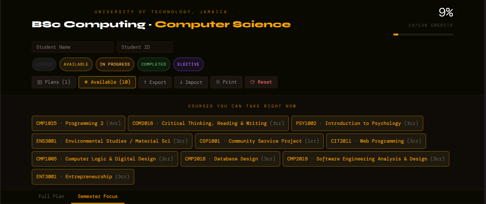
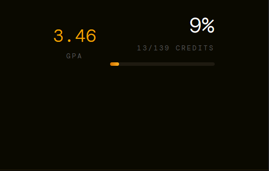
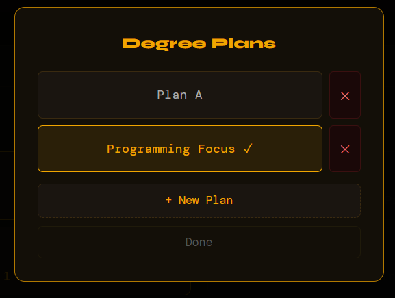

# utech-cs-planner

> An interactive degree-progress tracker for UTech Jamaica BSc Computing — Computer Science students.



🔗 **[Use it free — no install](https://wrightjayn.github.io/utech-cs-planner/)**

---

## What It Does

Click any available course to cycle its status: **Available → In Progress → Completed**.  
Prerequisite courses unlock automatically as you complete their dependencies.  
GPA and credit totals update in real time.

**No account. No server. Nothing leaves your browser.**

---

## Features

| Feature | Detail |
|---|---|
| 🔒 Prereq locking | Courses unlock only when dependencies are met |
| 📊 Live GPA tracker | Enter letter grades on completed courses for a running GPA |
| 🗓️ Semester Focus | Step through your degree one semester at a time |
| ◈ Available panel | See every module you can enrol in right now, at a glance |
| 📋 Degree Plans | Create and switch between multiple alternate degree paths |
| 💾 Offline-first | All data in `localStorage` — works without internet |
| 📤 Export / Import | JSON backup so you can move data between devices |
| ⎙ Print | Print-friendly view of your current plan |

---

## Screenshots

| View | Description |
|---|---|
|  | Full 4-level plan with credit totals per semester |
|  | Semester Focus view — navigate one semester at a time |
|  | Available panel showing modules ready to enrol |
|  | Grade entry and live GPA calculation |
|  | Multiple degree plan slots |

---

## How to Use

1. **Open** the [live app](https://wrightjayn.github.io/utech-cs-planner/) — no install needed.
2. **Click any available course** to mark it In Progress, then Completed.
3. **Enter a letter grade** (A, B+, C, etc.) on completed courses to track your GPA.
4. **Hit ◈ Available** to see all modules you're currently eligible to take.
5. **Use Semester Focus** to zero in on a single semester and plan your load.
6. **Create a Plan** via the Plans button to map out alternate degree paths.
7. **Export** your progress from the toolbar to back it up or move to another device.

> ⚠️ A warning appears if a semester exceeds the 18-credit limit.

---

## Elective Slots

SCIT upper-level elective slots let you browse and pick from the full SCIT elective catalogue directly inside the app. University elective slots work the same way.

---

## Local Development

```bash
git clone https://github.com/WrightJayN/utech-cs-planner.git
cd utech-cs-planner
npm install
npm run dev
```

Open `http://localhost:5173` in your browser.

---

## Project Structure

```
utech-cs-planner/
├── src/
│   ├── App.jsx         # Main planner component
│   └── main.jsx        # React entry point
├── screenshots/        # README screenshots
├── index.html
├── vite.config.js
└── README.md
```

---

## Curriculum Data

Course data is sourced from the official **UTech Jamaica BSc Computing — Computer Science** programme structure (2023 intake), including prerequisites, co-requisites, credit values, and elective options.

---

## Deployment

Built with React + Vite. Deployed to GitHub Pages via the `gh-pages` branch.

```bash
npm run deploy
```

---

## Contributing

Found a course discrepancy or a missing prereq? Open an issue or pull request.  
Contributions welcome — especially if UTech updates the programme structure.

---

## License

MIT — free to use, share, and modify.

---

*Built by Cepheus for UTech Jamaica Computer Science students. Not an official UTech product.*
